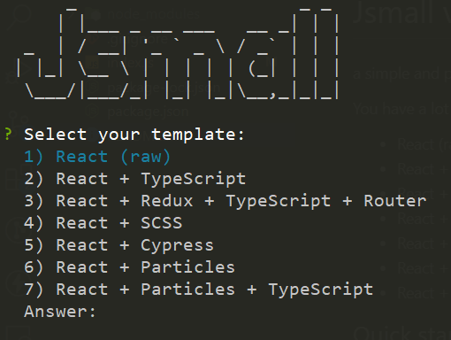

# jsmall

## The ultimate React project scaffolder

Jsmall is a command-line interface (CLI) tool that helps you create your react projects with standard foldering and also with typescript. With two simple step, jsmall will automatically create a new project and add the necessary folders and files based on best practices to get you started.

Jsmall helps developers to save time and increase productivity by automating the repetitive task of setting up a new React project, folders and files. It provides a recommended file structure for your project, includes support for TypeScript and ESLint, and provides a basic template for a new project.
  
## Features
You have a lot of Options like:

* React (raw)
* React + TypeScript
* React + Redux + TypeScript + Router
* React + SCSS
* React + Cypress
* React + Particles
* React + Particles + TypeScript

## Installation
You can use this command to install jsmall:

    npm i -g jsmall

## Usage
 Open a new terminal in any location you want to create project and use this command:

    jsmall init

Then, you will see something like this:

## Contributing 
If you are interested in contributing to jsmall, please feel free to submit a pull request or open an issue on the repository.

